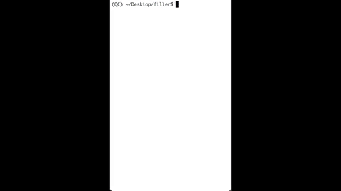

# Filler

This repository contains code to play the game Filler from [GamePigeon](http://gamepigeonapp.com/) against a bot. The bot's skill level is specified by the user and is a function of the number of moves it is able to look ahead. 

The script `solve.py` contains the algorithm through which the bot chooses a move. In brief, the bot iterates through possible moves, determines its opponent's move by calling the algorithm recursively, and chooses the move that results in the best score a specified number of steps ahead. The algorithm is written in pseudocode below, where `maxdepth` is a parameter provided by the user.

```
choose_move(depth, maxdepth)
- gather potential moves
- if depth == maxdepth:
    - find move that adds the most tiles
    - store that move as best move and its score as best score
- else:
    - for move in potential moves:
        - create board resulting from move (i.e. "make the move")
        - opponent move, opponent score = choose_move(depth + 1, maxdepth)
        - move score = 0 - opponent score
        - if move score beats best score yet, save this as best move and its score as best score
- return best move and best score
```

The game can be played in the terminal by running `python main.py <maxdepth> [<seed>]`, where `<maxdepth>` is the number of moves ahead the bot can look and `<seed>` is an optional random seed. An example is shown below.

